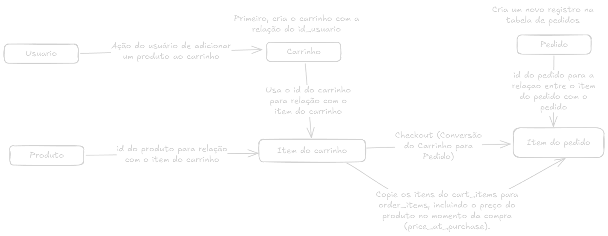

# Inspirations

https://dribbble.com/shots/25001090-Stella-Ecommerce-Website
https://www.figma.com/design/vKpQs4e5g8nLgvTlCbPfFc/E-commerce-Website-Template-(Freebie)-(Community)?node-id=0-1&node-type=canvas&t=s8Z5bWFpNwnokMoj-0

# Produtos
https://www.magazineluiza.com.br/kit-armario-de-cozinha-viena-compacto-com-4-portas-e-1-gaveta-balcao-multiuso-madine/p/dc3195f0k3/mo/mocz/
https://www.magazineluiza.com.br/armario-de-cozinha-completa-300cm-cinza-nice-madesa-01/p/gd30a22ef7/mo/mcoz/
https://www.magazineluiza.com.br/guarda-roupa-casal-com-espelho-6-portas-4-gavetas-araplac-braga/p/237759800/mo/guro/
https://www.magazineluiza.com.br/comoda-4-gavetas-2-portas-demobile-aurea/p/237139900/mo/como/]
https://www.magazineluiza.com.br/escrivaninha-mesa-para-computador-office-9409-madesa-branco/p/hkgh1bb3ke/mo/meav/
https://www.magazineluiza.com.br/escrivaninha-mesa-de-escritorio-de-canto-3-gavetas-branco-rustic-lisboa-madesa/p/dee9h2h494/mo/meav/
https://www.magazineluiza.com.br/painel-para-tv-ate-65-polegadas-1-porta-e-prateleiras-multimoveis-mp1064/p/gd1469gg2d/mo/mopa/
https://www.magazineluiza.com.br/rack-para-tv-72-2-portas-caemmun-tannen-1-8/p/237296200/mo/racm/

# Product Reference
<Image
  src="https://images.unsplash.com/photo-1611269154421-4e27233ac5c7?q=80&w=1965&auto=format&fit=crop&ixlib=rb-4.0.3&ixid=M3wxMjA3fDB8MHxwaG90by1wYWdlfHx8fGVufDB8fHx8fA%3D%3D"
  alt=""
  width={1020}
  height={1020}
  className="h-[530px] rounded-lg object-cover"
/>
MESA DE ESCRITÓRIO / MESA SIMPLES - CADEIRA SIMPLES
R$ 820,00
165L X 90C

# Estratégia de modelagem para relacionar carrinho de compras, produtos, e pedidos.

## Entidades Principais

- Usuários (users): Representa os usuários da aplicação.
- Produtos (products): Representa os produtos disponíveis para compra.
- Carrinhos (carts): Representa o carrinho de compras de cada usuário.
- Itens do Carrinho (cart_items): Representa os produtos adicionados ao carrinho.
- Pedidos (orders): Representa os pedidos gerados após o checkout.
- Itens do Pedido (order_items): Representa os produtos comprados em um pedido.

## Modelo de Banco de Dados

- Tabela: users

```sql
CREATE TABLE users (
  id SERIAL PRIMARY KEY,
  name VARCHAR(255) NOT NULL,
  email VARCHAR(255) UNIQUE NOT NULL,
  password_hash VARCHAR(255) NOT NULL,
  created_at TIMESTAMP DEFAULT NOW()
);
```
- Tabela: products

```sql
CREATE TABLE products (
  id SERIAL PRIMARY KEY,
  name VARCHAR(255) NOT NULL,
  description TEXT,
  price NUMERIC(10, 2) NOT NULL,
  stock_quantity INT NOT NULL,
  created_at TIMESTAMP DEFAULT NOW()
);
```

- Tabela: carts

```sql
Copiar código
CREATE TABLE carts (
  id SERIAL PRIMARY KEY,
  user_id INT NOT NULL,
  created_at TIMESTAMP DEFAULT NOW(),
  updated_at TIMESTAMP DEFAULT NOW(),
  FOREIGN KEY (user_id) REFERENCES users (id) ON DELETE CASCADE
);
```
- Tabela: cart_items

```sql
Copiar código
CREATE TABLE cart_items (
  id SERIAL PRIMARY KEY,
  cart_id INT NOT NULL,
  product_id INT NOT NULL,
  quantity INT NOT NULL CHECK (quantity > 0),
  FOREIGN KEY (cart_id) REFERENCES carts (id) ON DELETE CASCADE,
  FOREIGN KEY (product_id) REFERENCES products (id) ON DELETE CASCADE,
  UNIQUE (cart_id, product_id) -- Garante que o mesmo produto não seja adicionado duplicado
);
```
- Tabela: orders

```sql
CREATE TABLE orders (
  id SERIAL PRIMARY KEY,
  user_id INT NOT NULL,
  status VARCHAR(50) NOT NULL DEFAULT 'pending', -- Status: 'pending', 'completed', 'cancelled'
  total_price NUMERIC(10, 2) NOT NULL,
  created_at TIMESTAMP DEFAULT NOW(),
  FOREIGN KEY (user_id) REFERENCES users (id) ON DELETE CASCADE
);
```
- Tabela: order_items

```sql
Copiar código
CREATE TABLE order_items (
  id SERIAL PRIMARY KEY,
  order_id INT NOT NULL,
  product_id INT NOT NULL,
  quantity INT NOT NULL CHECK (quantity > 0),
  price_at_purchase NUMERIC(10, 2) NOT NULL, -- Preço do produto no momento da compra
  FOREIGN KEY (order_id) REFERENCES orders (id) ON DELETE CASCADE,
  FOREIGN KEY (product_id) REFERENCES products (id) ON DELETE CASCADE
);
```
## Fluxo de Dados
 
### Usuário Adiciona Produto ao Carrinho:
Ao adicionar um produto, insira ou atualize a tabela cart_items.

```sql
INSERT INTO cart_items (cart_id, product_id, quantity)
VALUES (1, 2, 1)
ON CONFLICT (cart_id, product_id)
DO UPDATE SET quantity = cart_items.quantity + 1;
```
### Checkout (Conversão do Carrinho para Pedido):
  - Crie um novo registro na tabela orders.
  - Copie os itens do cart_items para order_items, incluindo o preço do produto no momento da compra (price_at_purchase).
  - Exclua o carrinho e os itens associados.

```sql
Copiar código
BEGIN;

-- 1. Criar o pedido
INSERT INTO orders (user_id, total_price)
SELECT c.user_id, SUM(ci.quantity * p.price)
FROM carts c
JOIN cart_items ci ON c.id = ci.cart_id
JOIN products p ON ci.product_id = p.id
WHERE c.id = 1
RETURNING id INTO order_id;

-- 2. Inserir os itens do pedido
INSERT INTO order_items (order_id, product_id, quantity, price_at_purchase)
SELECT order_id, ci.product_id, ci.quantity, p.price
FROM cart_items ci
JOIN products p ON ci.product_id = p.id
WHERE ci.cart_id = 1;

-- 3. Atualizar o estoque dos produtos
UPDATE products
SET stock_quantity = stock_quantity - ci.quantity
FROM cart_items ci
WHERE products.id = ci.product_id AND ci.cart_id = 1;

-- 4. Excluir o carrinho e itens associados
DELETE FROM cart_items WHERE cart_id = 1;
DELETE FROM carts WHERE id = 1;

COMMIT;
```
### Atualização de Estoque:
Durante o checkout, reduza a quantidade em estoque (stock_quantity) de cada produto comprado.
Gerenciamento de Status do Pedido:

### Atualize o status do pedido (orders.status) conforme o progresso:
- pending: Pedido iniciado.
- completed: Pagamento confirmado e pedido concluído.
- cancelled: Pedido cancelado.

